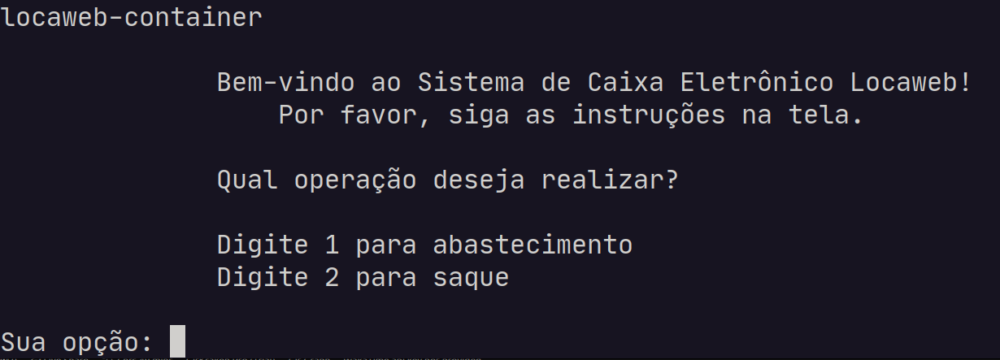
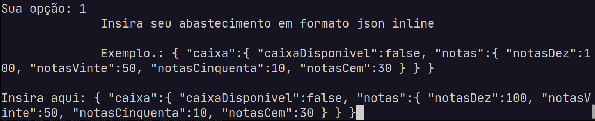
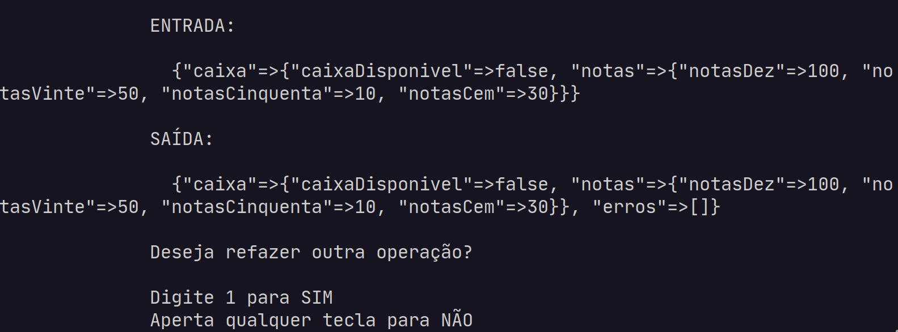
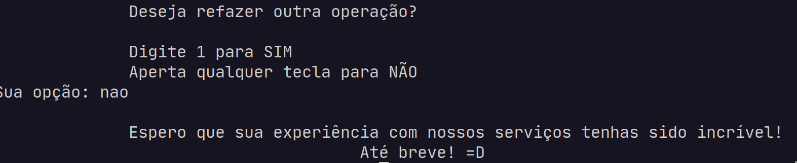
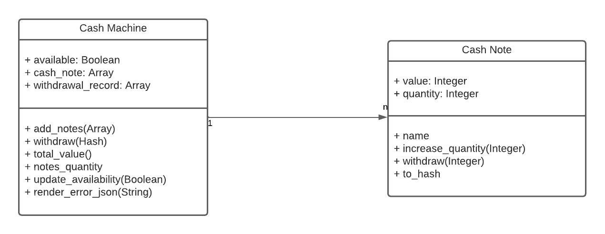
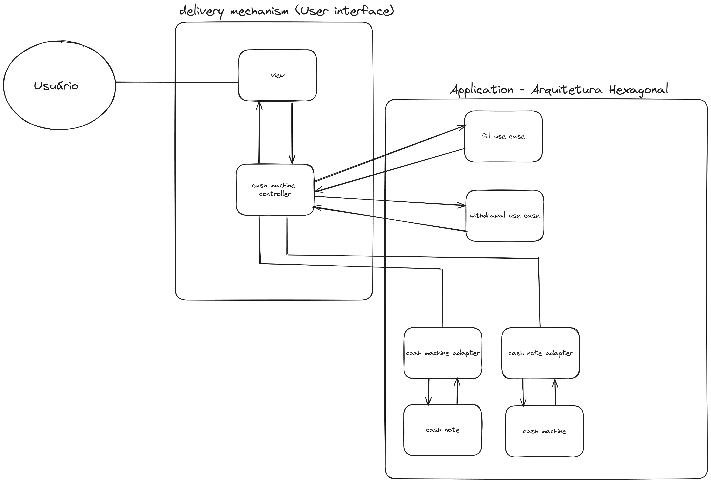
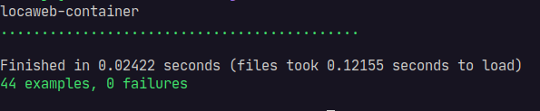

# Desafio Técnico Locaweb

> Por favor, para faciltar a visualização do README, abra-o em um visualizador de markdown (pode usar o markdown preview, uma extensão do vscode e outros editores).

-----
### Como rodar o projeto

##### Atente-se às dependências

- Docker
- Console bash (Alguma distro Linux ou o WSL2)

É necessário ter o docker instalado previamente, caso não tenha, é possível rodar a aplicação localmente, no entanto, a instalação do ruby 3.0.3 será necessária, assim como a instalação das dependências do projeto com `bundle install`. Caso esteja rodando em ambiente Windows e WSL2, também será necessário montar a imagem Docker seguindo os comandos nos arquivos `.sh` manualmente.

Como geralmente aplicação Ruby utiliza-se ambiente linux, seja com WSL ou nativamente, optei ter como base esse ambiente.

##### Scripts para facilitar rodar a aplicação

- run_start_app.sh
- run_terminal.sh
- run_tests.sh

#### Startando aplicação
```bash
sh run_start_app.sh
# ou
bash run_start_app.sh
```

Esse script irá construir a imagem docker e subir o container. Há algumas verificações para num caso de ser chamado uma segunda vez não ter que reconstruir tudo do zero e duplicar o que já existe. Na primeira vez que ele for chamado, irá demorar mais do que as outras por baixar as imagens necessárias. No final, ele entra no container criado e chama o interpretador do ruby para o arquivo que starta a aplicação stdin stdout.

#### Rodando os testes em Rspec
```bash
sh run_tests.sh
# ou
bash run_tests.sh
```

A dinâmica é a mesma do script anterior, mudando que ele roda o comando `bundle exec rspec`. Caso queira rodar os testes pode chamar diretamente através desse script para não ter que executar vários comandos antes do `bundle exec rspec`

#### Acessando o terminal
```bash
sh run_terminal.sh
# ou
bash run_terminal.sh
```

Similar aos outros scripts, porém o comando final acessa o console bash do container. Criei esse script para facilitar testes manuais se necessário.

> Atenção! Cuidado com o arquivo `config/application.rb`. É nele que é feito o autoload das classes para o teste e para a view (que starta tudo). Sem esse autoload a plicação não funcionará! Sem o `.rspec` os testes não funcionarão pois o load do `spec_helper` está lá, que por sua vez carrega o `application.rb` para os testes. Foi uma maneira mais clean para não carregar os arquivos em todo lugar, como o DRY (Don't Repeat Yourself) prega =D

----

### Funcionamento da aplicação

Após rodar o script que starta a aplicação, a seguinte tela irá aparecer.

#### Passo 1 - Tela de boas vindas


Com isso, o usuário poderá escolher qual operação deseja solicitar. 1 para abastecer e 2 para saque. Caso o valor inserido não seja um dos dois, o programa irá pedir para insirar novamente.

#### Passo 2 - Entrada do saque/abastecimento


Será necessário colocar uma entrada em json inline para o abastecimento. Logo após, o programa irá mostrar entrada e saída, respectivamente. Há diversos cenários cobertos, então caso a operação seja feita com sucesso, o array de erros[] estará vazio, cason contrário, estará com o erro em questão.

#### Passo 3 - Voltar ao passo 2 ou terminar programa


A saída seja de saque ou abastecimento (conforme escolhido) será mostrado. Após isso o programa irá perguntar se deseja realizar outra operação ou não. Caso prossiga, o programa voltará ao passo 2, caso contrário irá terminar o programa como a iamgem abaixo.



---

### Tecnologias utilizadas

- Ruby 3.3.0 (versão estável mais recente)
  - Rspec 3.4
- Docker

### Arquitetura e decisões

#### Modelagem e domínio
Primeiro, comecei modelando o domínio da aplicação. Sabemos que o domínio principal é o do próprio caixa eletrônico. Sabemos também que um caixa eletrônico pode ter várias notas. A etapa de modelagem é bem importante, gosto de separar um tempo para ela, pois nos ajuda a enxergar como cada objeto irá se comportar, quais suas responsabilidades no todo. Dessa forma, é possível deixar as entidades com uma alta coesão (cada um sabe o que faz e seu signifcado) e com um baixo acoplamento (classes não ficam dependentes uma da outra), um dos princípios da orientação à objetos. No fim, esse paradigma tem como objeto deixar a aplicaçao coesa e pouca acoplada. Digo pouca, pois é impossível ter um código 100% desacoplado, pois objetos trocam mensagem, e mensagens por si só geram "acoplamento".



##### Objeto caixa eletrônico

É o principal domínio da aplicação. No nosso contexto, uma nota não estando no caixa eletrônico não faz muito sentido, isso na funcionalidade de saque. No abastecimento, a nota é inputada posteriormente no caixa eletrônico, porém a ação pode falhar dado às regras de validação.

O objeto caixa "conhece" a nota, portando ele é o detentor da regra de adicionar e remover, delegando algumas responsabilidade de remover para cada nota que ele possui. Há outros comportamentos que adicionei para facilitar, como: valor total, quatidade de notas, atualizar a disponibilidade do caixa, etc.

##### Objeto nota

Cada objeto irá representar um tipo de nota, por exemplo, posso ter uma representação de nota de 20 com uma quantidade de 100. Portanto, cada caixa eletrônico pode ter apenas 4 dessas representações, dado que temos num primeiro momento nota de 10, 20, 50 e 100. Foi a maneira mais simplista e utilizando os conceitos de orientação à objetos que encontrei. Acredito que com essa modelagem facilmente podemos escalar a aplicação.

### Por que não usei Rails?
Ruby on Rails nada mais é que uma gem do Ruby extraída do projeto BaseCamp que empacota o que uma aplicação web MVC necessita. Aqui temos um sistema stdin e stdou. Eu amo o Rails e a sua filosofia, história e a sua famosa Doctrine, mas toda dependência tem um custo. Nesse meu inicio de carreira (4 anos), aprendi que nenhuma dependência vem sem custo. Por mais que o Rails tivesse algumas coisas que eu gostaria de usar nesse projeto, como o ActiveSupport, muitos outros módulos (a maioria) eu não usaria, como o ActiveRecord, já que não temos banco de dados. Adicionaria uma complexidade para algo simples e que não faria sentido. Menos é mais! Aliás, a filosofia do Rails é essa :)


### Arquitetura Hexagonal (Ports and Adapters)

Escolhi essa arquitetura pois ela separá do mundo externo (Banco de Dados, Interface, Sistemas externos) o domínio da nossa aplicação. Toda a lógica e regra de negócio se encontra nos hexágonos, no caso eu tenho um hexagono de ATM (Caixa eletrônico) e meu domínio está protegido e concentrado de intervenções externas. Qualquer nova regra de negócio ou validação deve ser inclusa aqui dentro, em seu respectivo domínio.

Separei a user interface pois ela não pertence ao hexágono, é apenas um delivery mechanism (mecanismo de entrega) do meu `domínio` para o mundo externo. Cada `use case` fica responsável por uma operação no sistema, que é o caso de abastecimento e saque. Os `adapters` é onde eu transformo a comunicação com a nossa user interface. Na controller da user interface, antes de chamar o caso de uso preciso `adaptar` o que recebi na entrada para o meu domínio. Portanto, aqui temos o adapter de caixa eletrônico e nota.

Alguns conceitos de DDD (Domain Driven design) também foi utilizado. Que é o caso de bounded contexts (contextos limitados). Hoje temos o contexto de caixa eletrônico, amanhã podemos ter um contexto separado para atendimento no caixa com uma pessoa real. Então criariamos um contexto próprio para isso, assim como seus domínios, use case, etc.

### User interface (Delivery Mechanism)

Nossa user interface (terminal) será o responsável por levar nosso domínio ao usuário (mundo externo). Decidi pegar emprestado o MVC do Rails rs. Mas só utilizando o View e Controller. A view conversa com o terminal e usuário, pegando as informações e mandando para a controller. Por sua vez, a controller faz a orquestração de tudo, dos inputs e outputs e mandando para o meu domínio através do adapter.

Minha view ou controller não precisa conhecer nada do meu domínio, ela apenas pede e o domínio executa. Esse conceito chama-se `Tell don't ask`, conceito muito conhecido na orientação à objetos. Esse mesmo conceito foi utilizado amplamento dentro do nosso domínio.


##### Diagrama alto nível da arquitetura




---
### Cobertura de testes

Realizei a criação dos testes unitários e de integração da aplicação. Em alguns momentos foi feito o uso do TDD para facilitar a visualização de algumas funcionalidades, como a de saque que foi mais complexa que a de abastecimento, dado suas regras de validação. O TDD é muito útil quando a implementação ainda está abstrata, nos ajuda a pensar na entrada e na saída de forma mais metódica, o que ajuda a entender como será a regra de negócio. O que estava mais fácil de enxergar o caminho, realizei a implementação e após os testes ou fui mesclando. Escrever os testes do domínio, use case e controller me ajudou a corrigir muita regra inconsistente e refatora-las. Sem uma cultura de testes, fica muito difícil enxergar essas possíveis inconsistências. O teste é uma cada a mais de validação e que gera muito valor. Acho que o valor do teste vai se mostrando ao longo do tempo, dado que se algum dev mexer de maneira errada em alguma funcionalidade o teste vai quebrar e mostrar o erro, por exemplo.

> Escreva testes e evite dor de cabeça! :)



